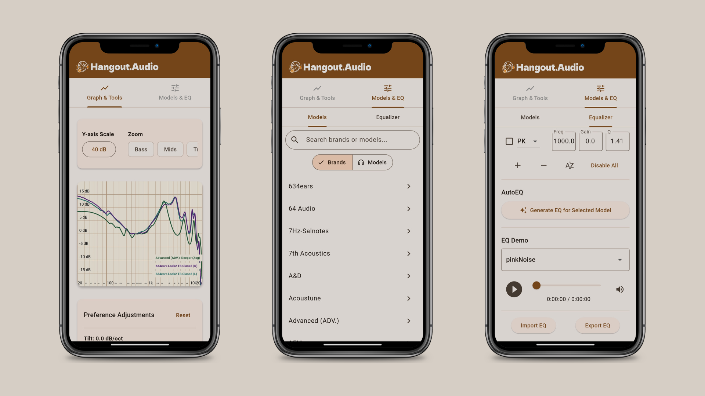

# Hangouts Crincale - Frequency Response Tool



A comprehensive Flutter application for analyzing, visualizing, and equalizing headphone and IEM (In-Ear Monitor) frequency response measurements. This tool provides professional-grade audio analysis capabilities with an intuitive user interface.

## 🎯 Overview

Hangouts Crincale is a frequency response analysis tool designed for audio enthusiasts, engineers, and professionals who need to visualize and analyze headphone measurements. The application supports loading multiple frequency response curves, comparing them against baselines, and applying parametric equalization with real-time visualization.

## ✨ Key Features

### 📊 Frequency Response Analysis

- **Multi-curve visualization**: Load and display multiple frequency response measurements simultaneously
- **Interactive graphing**: Custom-painted frequency response graphs with zoom and pan capabilities
- **Baseline comparison**: Set any loaded curve as a baseline for relative comparisons
- **Smoothing options**: Apply various levels of octave smoothing to frequency data
- **Normalization**: Normalize curves to specific frequency points and dB levels

### 🎛️ Parametric Equalizer

- **Real-time EQ visualization**: See EQ curve overlays on frequency response graphs
- **Multiple filter types**: Support for Peaking (PK), Low-shelf (LSQ), and High-shelf (HSQ) filters
- **Precise parameter control**: Adjust frequency, gain, Q-factor for each filter band
- **Pre-amp calculation**: Automatic pre-amp adjustment to prevent clipping
- **AutoEQ functionality**: Automated equalization target generation
- **Import/Export**: Save and load EQ presets

### 🎧 Headphone Database Integration

- **Extensive database**: Built-in database of headphone and IEM measurements
- **Brand categorization**: Organized by manufacturer with detailed model information
- **Search functionality**: Quick search across brands and models
- **Model details**: Pricing, review scores, and external links for each model
- **Multiple measurement variants**: Support for different measurement conditions per model

### 🛠️ Professional Tools

- **Graph customization**: Adjustable axis ranges, grid colors, and visual preferences
- **Data management**: Import/export functionality for measurements and settings
- **HID device support**: Integration with FiiO USB HID devices for direct hardware control
- **Cross-platform**: Available on Windows, macOS, Linux, iOS, Android, and web

## 🏗️ Architecture

### Built with Flutter & GetX

The application follows a clean architecture pattern using:

- **GetX State Management**: Reactive state management with controllers
- **MVC Pattern**: Clear separation between models, views, and controllers
- **Dependency Injection**: Managed through GetX bindings
- **Responsive Design**: Adaptive layouts for mobile and desktop platforms

### Project Structure

```
lib/
├── main.dart                    # Application entry point
├── app/
│   ├── bindings/               # Dependency injection bindings
│   ├── controllers/            # Business logic controllers
│   │   ├── equalizer_controller.dart
│   │   ├── graph_controller.dart
│   │   ├── selection_controller.dart
│   │   ├── audio_player_controller.dart
│   │   ├── manage_controller.dart
│   │   ├── preference_controller.dart
│   │   └── tools_controller.dart
│   ├── data/
│   │   ├── models/            # Data models
│   │   │   ├── frequency_response.dart
│   │   │   ├── eq_filter.dart
│   │   │   ├── phone_model.dart
│   │   │   └── brand.dart
│   │   └── providers/         # Data providers
│   ├── routes/               # Application routing
│   ├── services/             # Business services
│   └── ui/
│       ├── screens/          # Main application screens
│       └── widgets/          # Reusable UI components
│           ├── equalizer/
│           ├── graph/
│           ├── manage/
│           ├── preferences/
│           ├── selection/
│           └── tools/
└── handlers/
    └── fiioUsbHidHandler.dart  # Hardware device integration
```

## 🎮 User Interface

### Desktop Layout

- **Main Content Area**: Frequency response graph with tools and preferences
- **Side Panel**: Tabbed interface for model selection and equalizer controls
- **Responsive Design**: Automatically adapts to screen size

### Mobile Layout

- **Tab-based Navigation**: "Graph & Tools" and "Models & EQ" tabs
- **Touch-optimized**: Mobile-friendly controls and gestures
- **Vertical Layout**: Optimized for portrait orientation

### Key UI Components

1. **Graph Widget**: Custom-painted frequency response visualization
2. **Selection Panel**: Browse and select headphone models from database
3. **Equalizer Panel**: Parametric EQ controls with real-time preview
4. **Tools Section**: Graph customization and analysis tools
5. **Preference Panel**: User settings and visualization options
6. **Management Table**: Data import/export and curve management

## 🔧 Core Controllers

### GraphController

Manages frequency response visualization:

- Curve data storage and management
- Baseline selection and comparison
- Normalization parameters
- Smoothing levels
- Axis range controls
- Visual theming

### EqualizerController

Handles parametric equalization:

- EQ filter management (add/remove/modify)
- Target model selection
- Pre-amp calculation
- AutoEQ functionality
- Filter parameter validation

### SelectionController

Manages headphone database:

- Brand and model loading from JSON
- Search and filtering
- Model selection
- Frequency response data loading

### AudioPlayerController

Provides audio playback capabilities:

- Test tone generation
- Audio file playback
- Real-time EQ preview

## 📱 Platform Support

### Mobile Platforms

- **iOS**: Native iOS app with full functionality
- **Android**: Native Android app with material design

### Desktop Platforms

- **Windows**: Native Windows application
- **macOS**: Native macOS application with Cocoa integration
- **Linux**: Native Linux application with GTK integration

### Web Platform

- **Progressive Web App**: Browser-based version with offline capabilities

## 🔌 Hardware Integration

### FiiO USB HID Support

The application includes specialized handlers for FiiO audio devices:

- **Direct hardware control**: Send EQ parameters directly to compatible devices
- **Real-time adjustment**: Live parameter updates
- **Device detection**: Automatic detection of connected FiiO devices
- **Protocol support**: Full implementation of FiiO USB HID protocol

## 📊 Data Models

### FrequencyResponse

Represents a complete frequency response measurement:

- Unique identification (ID, brand, model)
- Data points (frequency, dB pairs)
- Visual properties (color, visibility)
- Reactive updates through GetX

### EqFilter

Parametric equalizer filter representation:

- Filter types (Peaking, Low-shelf, High-shelf)
- Parameters (frequency, gain, Q-factor)
- Enable/disable state
- Immutable updates with copyWith pattern

### PhoneModel

Headphone/IEM model information:

- Model identification and branding
- Multiple measurement files support
- Pricing and review information
- External links (reviews, purchase)

## 🚀 Getting Started

### Prerequisites

- Flutter SDK (^3.7.0)
- Dart SDK (^3.7.0)
- Platform-specific development tools

### Installation

1. Clone the repository
2. Install dependencies:
   ```bash
   flutter pub get
   ```
3. Run the application:
   ```bash
   flutter run
   ```

### Building for Production

```bash
# Web
flutter build web

# Mobile
flutter build apk          # Android
flutter build ios          # iOS

# Desktop
flutter build windows      # Windows
flutter build macos        # macOS
flutter build linux        # Linux
```

## 📦 Dependencies

### Core Dependencies

- **flutter**: UI framework
- **get**: State management and dependency injection
- **cupertino_icons**: iOS-style icons
- **intl**: Internationalization support

### Asset Structure

- **Headphone Database**: `assets/phones/phone_book.json`
- **Brand Logos**: `assets/images/`
- **SVG Graphics**: `assets/svgs/`
- **Measurement Data**: `assets/data/`

## 🎯 Use Cases

### Audio Engineers

- Professional measurement analysis
- EQ curve development
- Hardware testing and validation
- Quality assurance workflows

### Audiophiles

- Headphone comparison and selection
- Personal EQ tuning
- Measurement database browsing
- Purchase decision support

### Manufacturers

- Product development support
- Competitive analysis
- Quality control
- Marketing material generation

## 🔮 Technical Features

### Performance Optimizations

- **Custom painting**: Direct canvas rendering for smooth graph animations
- **Reactive updates**: Efficient state management with GetX observables
- **Lazy loading**: On-demand data loading for large datasets
- **Memory management**: Proper disposal of controllers and streams

### Data Processing

- **Frequency domain analysis**: Professional-grade DSP algorithms
- **Smoothing algorithms**: Multiple octave smoothing options
- **Interpolation**: Smooth curve rendering between data points
- **Normalization**: Mathematical curve alignment and comparison

## 🎨 Customization

The application supports extensive customization:

- **Themes**: Material Design 3 theming with custom color schemes
- **Graph appearance**: Grid colors, line styles, axis formatting
- **Measurement display**: Multiple curve overlay options
- **User preferences**: Persistent settings storage

## 🏆 Project Quality

### Code Organization

- **Clean architecture**: Separation of concerns
- **Type safety**: Comprehensive use of Dart's type system
- **Documentation**: Inline code documentation
- **Reactive patterns**: Consistent use of observable patterns

### Cross-platform Compatibility

- **Responsive design**: Adaptive layouts for all screen sizes
- **Platform conventions**: Native look and feel on each platform
- **Performance**: Optimized rendering for smooth 60fps operation

This project represents a professional-grade audio analysis tool built with modern Flutter development practices, providing both powerful functionality and an intuitive user experience across all supported platforms.
